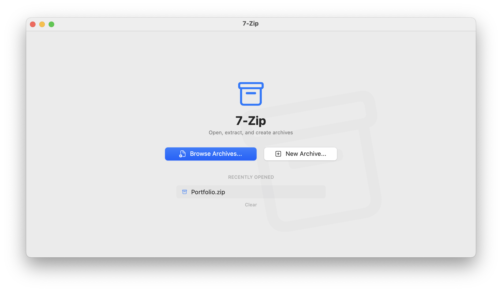

# 7-Zip for macOS



A native macOS archive manager with both **GUI** and **CLI** interfaces.

## Features

- **SwiftUI GUI** – modern macOS app with archive browsing, extraction, and creation
- **CLI + TUI** – command-line tool with an interactive terminal UI
- **Formats** – 7z, ZIP, RAR (extract), TAR, GZ, BZ2, XZ, ISO and more
- **Password support** – create and open encrypted archives
- **File associations** – right-click any archive → "Open With" → 7-Zip
- **Drag & drop** – drop archives onto the app window
- **Self-contained** – the archive engine ships inside the app bundle

## Quick Start

### Prerequisites

- macOS 14+
- Xcode 15+ (or Command Line Tools)

The `7za` archive engine is bundled in `resources/bin/` and gets embedded into
the app bundle, so no separate p7zip install is needed. The engine is resolved
in this order:

1. `7-Zip.app/Contents/Resources/bin/7za` (embedded)
2. a `bin/7za` sidecar next to the executable
3. a system `7z` / `7za` / `7zz` on the usual prefixes or on `PATH`

Run `7z --tool` to print the engine actually in use, and set `SEVENZIP_DEBUG=1`
to trace every engine invocation on stderr.

The bundled `7za` is p7zip's *reduced* build: it handles 7z, zip, tar, gzip,
bzip2, xz, Z and zstd, but has **no RAR, ISO, DMG, WIM or CAB codecs**. When an
engine cannot read a file, the app automatically retries the next one, so
install these for wider format support:

```bash
brew install sevenzip   # 7zz — official 7-Zip: ISO, DMG, WIM, CAB, older RAR
brew install unar       # unar — The Unarchiver: newer RAR (see below)
```

**Newer RAR archives need `unar`, not a newer 7-Zip.** WinRAR 7.0 introduced
compression version 6 (`Method = v6:…`), which *no* 7-Zip build decodes — not
even 26.x. 7-Zip still reads the headers, so such an archive lists correctly
and then fails on extraction with `Unsupported Method` for every entry, leaving
a zero-byte file behind for each. The app detects this and hands the archive to
`unar`, which extracts it correctly.

Without a capable engine you get a clear error rather than an empty window.

### Build & Install (SwiftUI App)

```bash
cd SevenZipSwift

# Build GUI app
swift build --product "7-Zip" --configuration release

# Build CLI tool
swift build --product "7z" --configuration release

# Install to /Applications and /usr/local/bin.
# Run it as yourself, NOT with sudo — it elevates only the steps that need
# root, so the build cache stays owned by you.
./install.sh

# Remove
./install.sh uninstall
```

### Build (Qt/C++ App)

```bash
mkdir build && cd build
cmake ..
make
```

## Project Structure

```
7-Zip/
├── SevenZipSwift/         # Swift/SwiftUI implementation
│   ├── Sources/
│   │   ├── SevenZipApp/   #   macOS GUI app (SwiftUI)
│   │   ├── SevenZipCLI/   #   CLI + TUI tool
│   │   ├── CSevenZip/     #   C++ archive bridge
│   │   └── CNcurses/      #   NCurses wrapper
│   ├── Resources/         # Icons, asset catalog
│   ├── scripts/
│   │   ├── make-app-bundle.sh  # Assemble 7-Zip.app
│   │   └── smoke-test.sh       # End-to-end CLI test suite
│   └── install.sh         # Install/uninstall script
├── src/                   # Qt/C++ implementation
├── resources/             # Qt app resources + bundled 7za
└── CMakeLists.txt         # Qt build config
```

## Usage

**GUI:** Launch from Applications or open archives via right-click → "Open With".

**CLI:**

```bash
# List archive contents
7z list archive.7z

# Extract archive (defaults to the current directory)
7z extract archive.7z
7z extract archive.7z ./output

# Create archive — the format follows the extension
7z create output.7z file1.txt file2.txt
7z create backup.tar.gz ./folder

# Override the format explicitly, set compression, encrypt
7z create -t 7z -mx 9 -p secret archive.7z folder/

# Open an encrypted archive
7z list -p secret archive.7z

# Show which archive engine is in use
7z --tool

# Interactive terminal UI
7z
7z --tui
```

### Formats

| Format | Create | Extract |
| ------ | :----: | :-----: |
| 7z, zip, tar | ✓ | ✓ |
| tar.gz, tar.bz2, tar.xz | ✓ | ✓ |
| rar (older) | — | ✓ (needs `sevenzip`) |
| rar (WinRAR 7+, `v6`) | — | ✓ (needs `unar`) |
| iso, cab, dmg, wim, arj, lzh, … | — | ✓ (needs `sevenzip`) |

Compound formats (`tar.gz`, `tar.bz2`, `tar.xz`) are built in two steps: the
files go into a tar named after the final archive, which is then compressed.
Extracting one yields the inner `.tar`, matching standard 7-Zip behaviour.

When `-t` is omitted, the format is inferred from the destination extension
(`.tgz`, `.tbz2` and `.txz` are recognised as their compound equivalents), and
falls back to zip for an unknown extension.

## Testing

`scripts/smoke-test.sh` drives the real archive engine end to end — no mocks —
covering round-trips for every creatable format, format inference, compound
archive internals, listing edge cases, passwords, error handling, and temp-file
cleanup.

```bash
cd SevenZipSwift

# Build the release CLI, then test it
./scripts/smoke-test.sh

# Or test a binary you already built
./scripts/smoke-test.sh /usr/local/bin/7z
```

It exits non-zero if any case fails.

## License

This project is based on p7zip and the 7-Zip SDK.
